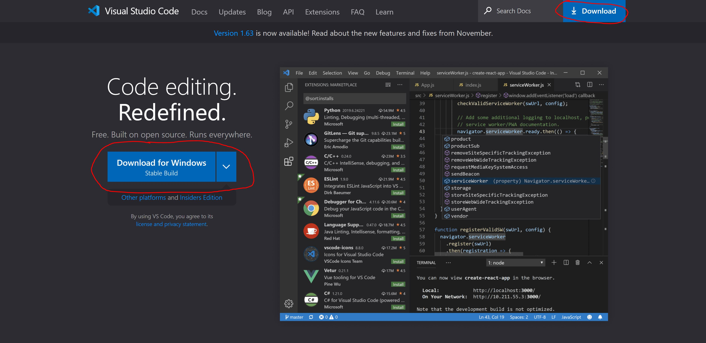
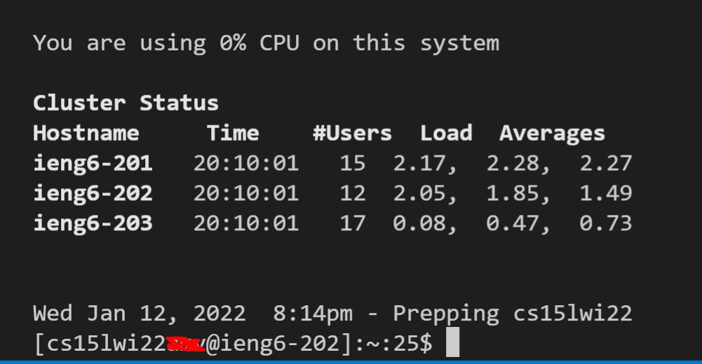
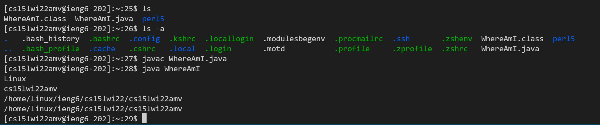
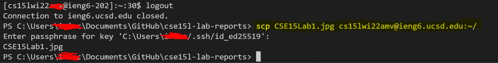
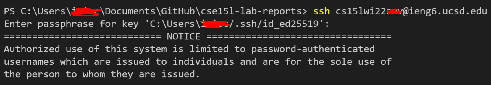
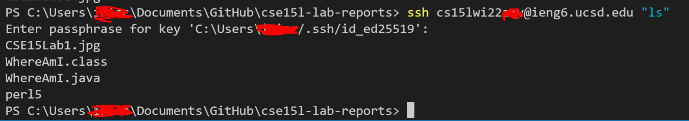

# Installing VSCode
VSCode, short for Virtual Studio Code, is a text editor commonly used for programming. 
The download can be found on their website:
## [Download](https://code.visualstudio.com/) 
 The home page should look something like this. Click the download link (circled) and follow the installation steps.
 
# Remotely Connecting
First, install OpenSSH on your system (if you haven't already). Next, find your ID at the following link.
## [ID Search](https://sdacs.ucsd.edu/~icc/index.php)
Once you find your ID, you can log in using your ID, except replacing the 'zzz' with your three letter ID.
## `$ ssh cs15lwi22`zzz`@ieng6.ucsd.edu`
Then type in your password. Please note that you will NOT see characters being typed in, but they are being registered. When you successfully log in, this is what the terminal should look like.

# Commands
In order to see what is present in the directory, you can use `ls`. You can also use `ls -a` to view all of the files on the server. Finally, you can compile and run files as you would on your system. WhereAmI.java shows information about where the command is being run from.

# Moving Files with scp
Press Ctrl + D to disconnect. Now that you're back on your computer's terminal, you can use the SCP command. Use the following code, which is your file followed by your ID: 
## `scp filename.java cs15lwi22`zzz`@ieng6.ucsd.edu:~/`
This should look like the following (I used the file *CSE15Lab1.jpg*)

# Setting an SSH Key
If you’re on Windows, then you need to follow the extra ssh-add steps here: 
## [Steps](https://docs.microsoft.com/en-us/windows-server/administration/openssh/openssh_keymanagement#user-key-generation)
Then, on your computer, you can input the command `$ ssh-keygen` .
Then copy the public key to the .ssh directory of the server. If done correctly, when you try to log onto the server or run a command on it, it shouldn't ask for a full log-in. Here is an example:

Notice how it asks for a passphrase for the key rather than a log-in.
# Optimizing Remote Running
You can run any command to the server without being logged onto it, using the following command:
## `$ ssh cs15lwi22`zzz`@ieng6.ucsd.edu "<insert command here>"`

So long as the keys are set up properly, you should not be prompted to log in. This can work for any command, and even multiple commands at once.
To optimize the process, you would want to:
1. Create a document with the commands you need. Then copy/paste them in the correct order. If you've already used them once you can press the up arrow key to access them.
2. Make edits to the WhereAmI.java file and save them.
3. Paste the following command and hit enter:
## `$ ssh cs15lwi22`zzz`@ieng6.ucsd.edu "scp WhereAmI.java"`
Ctrl C+V and Enter should only require three keystrokes and take less than 4 seconds.