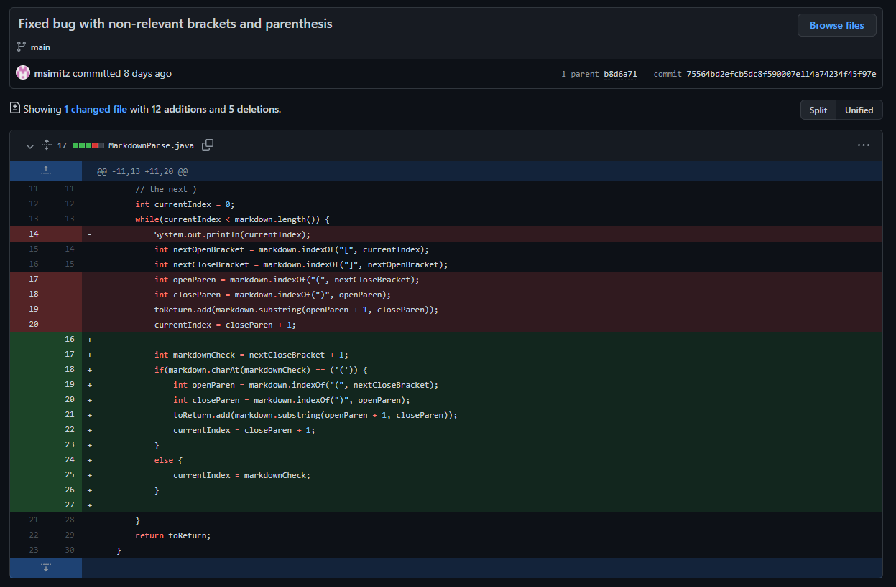
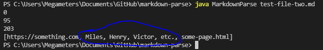
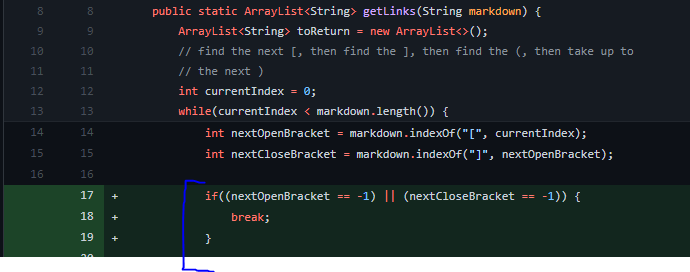
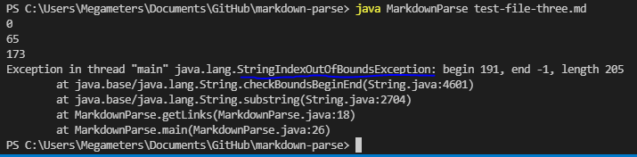
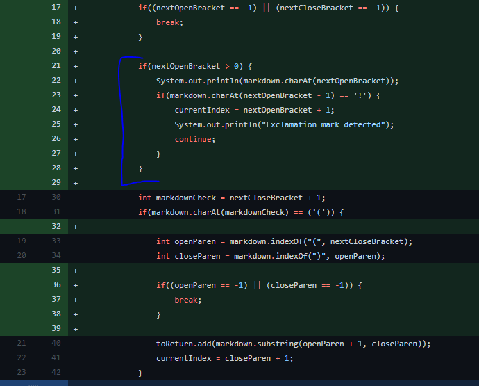
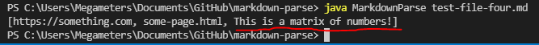

# Code Change 1

## [Commit](https://github.com/msimitz/markdown-parse/commit/75564bd2efcb5dc8f590007e114a74234f45f97e)

This first error is that brackets and parenthesis can be considered links, even if they aren't intended to be. There is a massive discrepancy in the proximity between the brackets and the parenthesis, yet it is still counted. Following is the test file that broke the code.

## [Test File](test-file-two.md)

## Symptom

What was supposed to be irrelevant text inside parenthesis ended up being turned into a link, simply because there was a pair of brackets before it.

In order to fix this, we added code that required the parenthesis to be immediately following the brackets in order for it to be considered a link. With these edits, the code would no longer recognize 'Miles, Henry, Victor, etc.' as a link.

# Code Change 2

## [Commit](https://github.com/msimitz/markdown-parse/commit/c7d765f83ecdcd05fa099515d66eccbade8e3760)

This next error is that, if a link is incomplete, there is potentially an indexOutOfBounds error. This is because the file continues to search the rest of the file for a closing parenthesis even if it doesn't exist.

## [Test File](test-file-three.md)

## Symptom

By first scouting the rest of the file for a closing parenthesis or bracket, we assure that if there are no longer any markdown links present, we can safely end the program. This prevents any errors from occuring.

# Code Change 3

## [Commit](https://github.com/msimitz/markdown-parse/commit/c7d765f83ecdcd05fa099515d66eccbade8e3760)

(Same commit as previous, two bugs were fixed. A different section of the commit is shown in the image below)

The final error we analyzed was if the link is an image instead of a webpage. We figured that a separate program would handle images and so we modified our code to ignore links that have an '!' directly in front of them.

## [Test File](test-file-four.md)

## Symptom

Here, the text that is supposed to be an image is still counted as a link by the program. By checking for the exclamation mark before, we can assure that the links that get printed are actually links, rather than images. The matrix of numbers (which is supposed to model an image) is no longer printed.