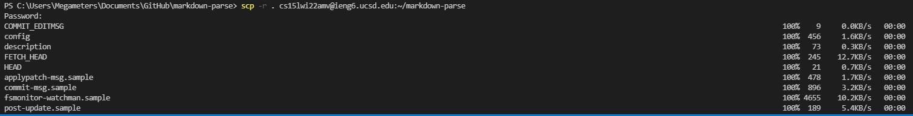
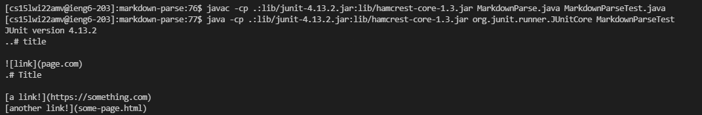
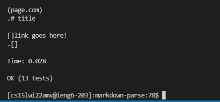
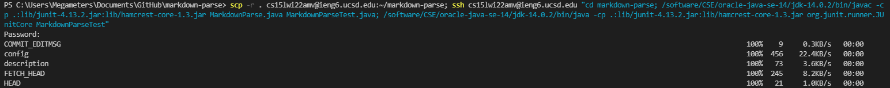
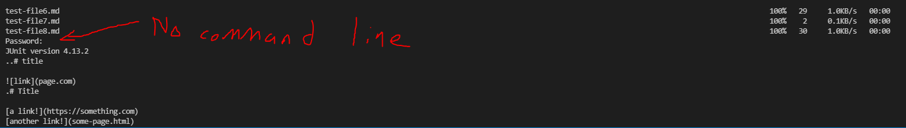

# Copying whole directories with scp -r
The first step is to navigate to the markdownparse folder. Then, once there, you input the command
## `scp -r cs15lwi22`zzz`@ieng6.ucsd.edu:~/markdown-parse`
This should result in a long chain of files being pushed over, looking like the following:

Naturally, it goes on longer than that. It includes the filesize of each file, the speed of the upload, and how long it took to upload it. Now that the files are hosted on @ieng6, you can run them remotely from the cloud.

Below, I changed the directory to the markdown-parse file, compiled MarkdownParse and MarkdownParseTest, and ran them on the server.

Lastly, I just have to write the command to execute this all in one step. 

The command I used is:

## `scp -r . cs15lwi22amv@ieng6.ucsd.edu:~/markdown-parse; ssh cs15lwi22amv@ieng6.ucsd.edu "cd markdown-parse; /software/CSE/oracle-java-se-14/jdk-14.0.2/bin/javac -cp .:lib/junit-4.13.2.jar:lib/hamcrest-core-1.3.jar MarkdownParse.java MarkdownParseTest.java; /software/CSE/oracle-java-se-14/jdk-14.0.2/bin/java -cp .:lib/junit-4.13.2.jar:lib/hamcrest-core-1.3.jar org.junit.runner.JUnitCore MarkdownParseTest"`
`

First, the scp -r command copies over the directory. Next, it uses the ssh command to navigate to the directory through cd, compile both of the files, and then run the tester file. All of this is accomplished through one terminal line. javac and java have been replaced with software/CSE/oracle... in accordance with the following piazza post: 

## [Piazza Link](https://piazza.com/class/kxs0toocqhv4og?cid=354)

Images of the process are included here:

