# Week 8 Lab - Debugging
# Step 1 - Other Group's Code

## [Repo Link](https://github.com/CatFish47/markdown-parse)

# Snippet 1
According to the VSCode preview, this is what we would expect:

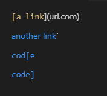

This is the test written to examine if the output is correct or not:

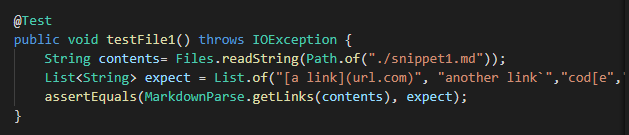

After testing, it was clear that the other group's code did not act identical to the markdown preview. 

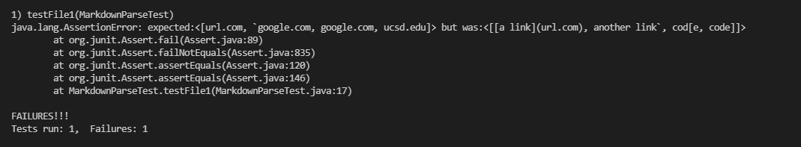

One interesting thing to note was that the other group's code returned the link itself, rather than the text. This is likely a bug that will need to be adjusted later.

# Snippet 2

This is what VSCode expects:

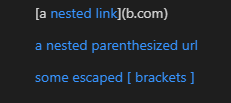

Here is the test I used, very similar to the previous...

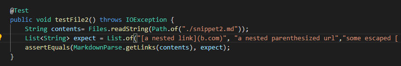

And here are the results of the test.

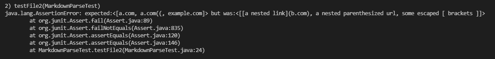

Another assertion error, but with very similar issues. The other group's code posts the links. But it's technically less correct than the VSCode interpretation.

# Snippet 3

Here's the VSCode preview:

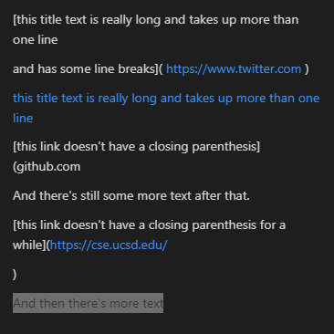

And the JUNIT test:

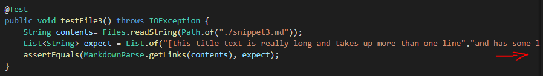

And the results.

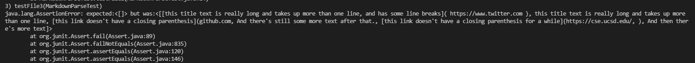

This test was interesting because it detected no valid links here. Likely, their code did not take line breaks into account.

# Step 2 - Our Code

## [Repo Link](https://github.com/vs2961/markdown-parse)

# Snippet 1

As a reminder, this is what we would expect:

I'll be using the same tests as before. Here is the result for the first test:

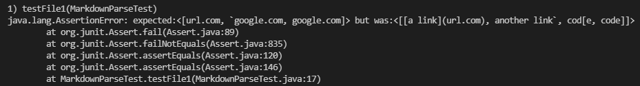

It seems we have a similar issue where markdownparse.java is outputting links instead of the text inside the links. However, the text we received is different from the other group. Specifically, they got four links while we only got three. The last ucsd link was not included in our code.

# Snippet 2

Expected:

Results:

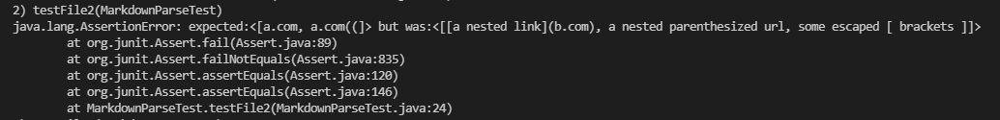

Similar to before, we have one less link. This means that one condition is triggering for the other group's code but not for ours. Somehow our code is rejecting one of the links.

# Snippet 3

Expected:

Results:

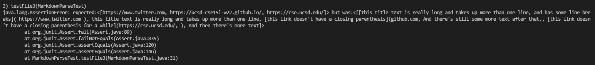

Contrary to the other group's code, ours picked up on the line breaks. Effectively, our code was correct on this test.

# Discussion

## Snippet 1

One major change that could be implemented is the output. There is no way to reliably check the text of the links, only the links. If you created another list and inputted the text to correspond with each link, markdownparse would be a stronger program and much easier to test. 

## Snippet 2

Neither code necessarily prepares for nested brackets and parenthesis. You could try to implement code that registers the first and last brackets before parenthesis (and glosses over the middle ones as text) and the first and last parenthesis. This might be a bit more nuanced because you have to determine when one link starts and the next begins.

## Snippet 3

Our code succeeded in this case, but the other group's code did not function with line breaks. I believe the change would only involve editing one line in their code:

`31. markdown.charAt(closeParen - 1) == '\n'`

It believes they are intentionally checking for newline characters. In this case, it contradicts with VSCode's markdown checker. If they removed this line, markdownparse would no longer check for line breaks, and it would match up more.