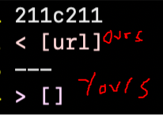
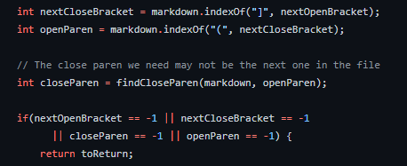
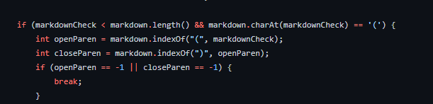
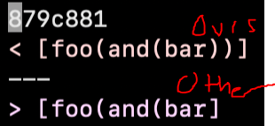
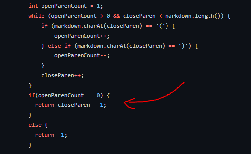

# Week 10 Lab - Debugging Mark II

## The Process

I used `script.sh` on bash to run the files in bulk. Then, I used diff and >> on MarkdownParse.java to compare our repository to the other implementation. I looked through the differences manually, picking out test cases that seemed noticeably different. There were about 10 test cases where there were differences, but I picked out the ones that seemed significant to me. 

## Test 1 - test-files/194; [Link](https://github.com/ucsd-cse15l-w22/markdown-parse/blob/main/test-files/194.md)

Code: `[Foo*bar\]]:my_(url) 'title (with parens)' [Foo*bar\]]`

Expected output: 

Result:

In this case, neither of the pieces of code are correct. It seems like both pieces of code got caught up with all of the brackets and parenthesis. I believe the first Foo*bar] is the valid link and the (url) in parenthesis after is what it leads to. The rest is just noise. The difference between the two implementations is that ours picked up the [url] as a link, which is closer to the right answer, compared to the other implementation which picked up no valid links.

Fixing the implementation for this one is a bit tricky. It's a bit hard to pinpoint the exact problem. My best guess is we need to adjust the proximity of the brackets to the parenthesis, and be a bit more lenient. The markdown preview makes it clear that the square brackets don't have to be directly next to the parenthesis. The lines of code influencing this are shown here:

As for our code, the lines influencing the proximity are here:

The other possibility is that the programs are getting confused from the onslaught of brackets and special characters, which would still be involved with those lines of code.

## Test 2 - test-files/495; [Link](https://github.com/ucsd-cse15l-w22/markdown-parse/blob/main/test-files/495.md)

Code: `[link](foo(and(bar)))`

Expected output:

Result:

In this case, both implementations recognized the link. The point of contention is how many parenthesis and brackets are included inside of the link. The link navigates to `foo(and(bar))`, which means that our implementation would be correct. The other implementation, despite including all of the text, neglected the ending two parenthesis and did not include them in the link.

To fix the other implementation, we would change the code that looks for the nextCloseParenthesis. I would adjust it so that, for each left parenthesis that appears, it allows one right parenthesis to be covered as well. When it reaches the last right parenthesis, even if there are leftover left parenthesis, it would close the link off anyway. The other implementation does the first half of this correctly, but not the leftover parenthesis. The code influencing this is shown here:

